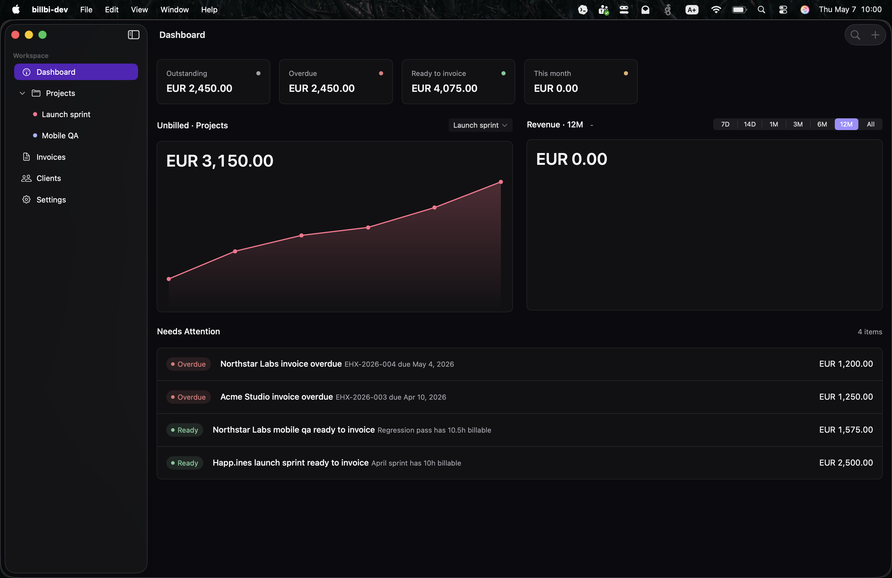

# Issue 43 Brand Color Verification

Date: 2026-05-07

## Screenshot Audit

Captured with the macOS app running in dark appearance using the sample workspace seed:

```sh
open -n "<DerivedData>/Build/Products/Debug Dev/billbi-dev.app" --args --billbi-seed-workspace
screencapture -x docs/verification/issue-43-brand-color/dashboard-dark.png
```



Observed:

- The primary sidebar selected row uses the darker brand-family selection treatment.
- The app remains close to monochrome in dark mode.
- The selected chart range chip uses the Brand Color family.
- The dashboard includes representative chart surfaces for visual comparison.

## Source Audit

Static source checks verified the remaining token surfaces that are not all visible in the dashboard screenshot:

- Primary action buttons use `BillbiColor.brand`, `BillbiColor.brandMuted`, and `BillbiColor.brandBorder`.
- Focused text inputs use `BillbiColor.brandBorder` and `BillbiColor.inputFocusBorderWidth`.
- Selected invoice filters use `BillbiColor.brand`.
- Single-series branded dashboard charts use `BillbiColor.brand`.
- Primary sidebar selected rows use `BillbiColor.primarySidebarSelection`.
- `AccentColor.colorset` light and dark appearances match `BillbiColor.brand`.
- Swift source has no references to the old token names.
